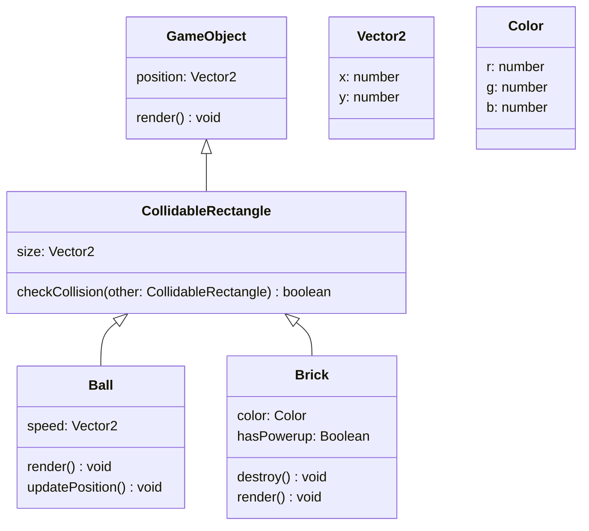

# OOP Example Docs

## Class diagram

## Vector2

Represents a 2-dimensional vector, or a point.

### Attributes

x: number
:	Horizontal component.

y: number
:	Vertical component.

## Color

RGB (red, green, blue) color.
Each component is a number within range [0, 1].

### Attributes

r: number
:	Red component.

g: number
:	Green component.

b: number
:	Blue component.

## GameObject

An object in the game that can be drawn on the screen.

### Attributes

position: [Vector2](#vector2)
:	Position of the object on screen.

### Methods

render() : void
:	This is just a placeholder (abstract method) to indicate that all classes extending [GameObject](#gameobject) should provide their own implementation for `GameObject.render()`.

## CollidableRectangle

An object with collision detection. Regardless of the object's real shape, it is represented by a rectangle for the purpose of simplifying collision detection. The rectangles never rotate, only move.

### Parent Class

**[GameObject](#gameobject)**

### Attributes

size: [Vector2](#vector2)
:	Size of the rectangle.

!!! note
	CollidableRectangle does not need a `position` attribute because it inherited one from [GameObject](#gameobject).

### Methods

checkCollision(other: [CollidableRectangle](#collidablerectangle)) : boolean
:	Returns `true` if the objects collide, otherwise returns `false`.

## Ball

The ball. If the ball falls off the screen, the player looses a life. The ball can destroy bricks when it hits them.

### Parent Class

**[CollidableRectangle](#collidablerectangle)**

### Attributes

speed: [Vector2](#vector2)
:	Distance traveled by the ball per second.

### Methods

render( ) : void
:	Draw the ball.

updatePosition( ) : void
:	Updates the ball's position according to its current speed.

	If the ball hits a brick, it bounces (changes `Ball.speed` direction) and destroys the brick.

## Brick

A brick. All bricks must be destroyed by the ball to complete the level.

* The bricks do not move.
* Each brick has a different color.
* The bricks are destroyed when hit by the ball.
* Some bricks give a power-up, when destroyed.

### Parent Class

**[CollidableRectangle](#collidablerectangle)**

### Attributes

Color: [Color](#color)
:	Color of the brick

hasPowerup: boolean
:	Set to `true` if the brick gives a power-up when destroyed, otherwise `false`.

### Methods

render( ) : void
:	Draw the brick.

destroy( ) : void
:	Destroy the brick, so that it is no longer visible.